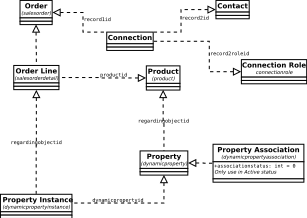

# ersa-Dynamics - a module of easy queries of MS Dynamics instance of eRSA

Provides APIs to map MS Dynamics entities and queries for Python applications: reporting and others.

## Development
To run quick tests or examples, add package path (current path) to `PYTHONPATH` like this:

```shell
export PYTHONPATH=$PYTHONPATH:`pwd`
```

When using VS Code, this is the `.vscode/settings.json` of the project assuming	 virtual environment is `py3_env`:

```JavaScript
{
    "python.linting.enabled": true,
    "python.linting.pylintEnabled" : true,
    "python.pythonPath": "py3_env/bin/python",
    "python.autoComplete.extraPaths": [
        "py3_env/lib/python3.4/site-packages",
        "."
    ],
    "python.formatting.provider": "yapf"
}
```

## Installation
There are a few ways to install this module:

1. Install from source
    ```
    source YOUR_VIRTURAL_ENV
    cd ersaDynamics
    python setup.py install
    ```
1. pip + github.com
    ```shell
    source YOUR_VIRTURAL_ENV
    pip install [-e] git+https://github.com/eResearchSA/ersaDynamics.git#egg=ersa-Dynamics
    ```

    **Note:**

    You may need to update `setuptools` even `pip` before install the package:
    `pip install --upgrade pip setuptools`

## Important files
### `conf.json`

```javascript
{
  "resource": "https://yourinstance.yourorg.dynamics.com",
  "tenant": "TENANT_ID_FROM_AZURE_AD",
  "authorityHostUrl": "https://login.microsoftonline.com",
  "clientId": "CLIENT_ID_FROM_AZURE_AD",
  "clientSecret": "CLIENT_CREATED_AT_AZURE_AD"
}
```

### Token file: default name is `saved_tokens.json`

Such file has two tokens: `access_token` and `refresh_token`. Call `retrieve` method in [ADALConnection](edynam/connection.py)
to load them from a such file or `refresh` to refresh them either from a such file or previously loaded
tokens.

## About models - entities

In [models.py](edynam/models.py) there are a few classes to represent entities of Dynamics:

1. Project
1. Product
1. Account
1. Contact
1. Opportunity
1. Order
1. OrderDetail
1. PropertyInstance
1. DynamicProperty
1. Optionset
1. Connection
1. ConnectionRole

Some entities in the list above used in important relationships are show in the diagram blow. Some entities are not visible to end users.


